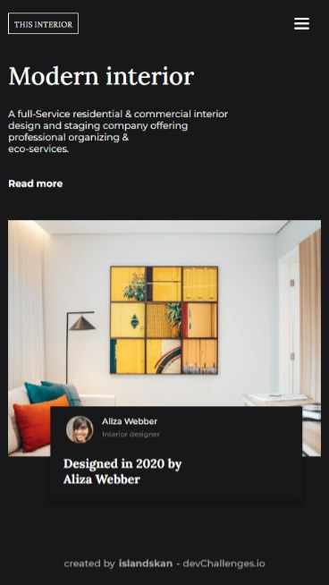
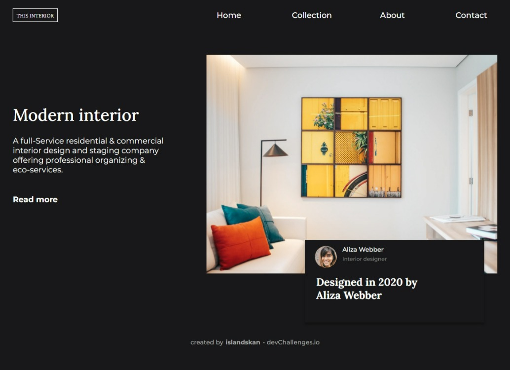

<h1 align="center">Devchallenges - Interior Consultant</h1>

   Solution for a challenge from  <a href="http://devchallenges.io" target="_blank">Devchallenges.io</a>.

  <h3>
    <a href="https://islandskan-interior-consultant.netlify.app/">
      Demo
    </a>
     | 
    <a href="https://github.com/islandskan/devchallenges-responsive-interior-consultant">
      Solution
    </a>
     | 
    <a href="https://devchallenges.io/challenges/Jymh2b2FyebRTUljkNcb">
      Challenge
    </a>
  </h3>

<!-- TABLE OF CONTENTS -->

## Table of Contents

-   [Overview](#overview)
    -   [Built With](#built-with)
-   [Features](#features)
-   [Contact](#contact)
-   [Acknowledgements](#acknowledgements)

<!-- OVERVIEW -->

## Overview

### Built With

<!-- This section should list any major frameworks that you built your project using. Here are a few examples.-->

## Features

## Acknowledgements

## Contact

-   GitHub [@islandskan](https://github.com/islandskan)
-   LinkedIn [Sigridur Eggertsdottir](https://www.linkedin.com/in/sigridureggertsdottir/)
